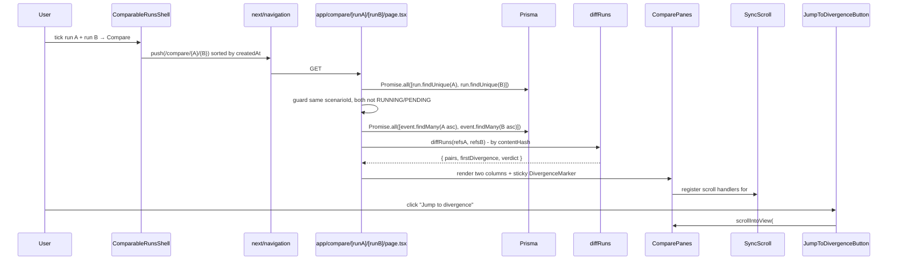

# Agent Regression Lab - Technical Guide

---

## Table of Contents

1. [What the app does](#1-what-the-app-does)
2. [Project structure](#2-project-structure)
3. [Full request flow (diagrams)](#3-full-request-flow-diagrams)
4. [Foundation layer](#4-foundation-layer)
   - 4.1 [Event schemas - `src/server/events/types.ts`](#41-event-schemas--srcservereventstypests)
   - 4.2 [Canonical JSON + hashing - `src/server/events/canonical.ts`](#42-canonical-json--hashing--srcservereventscanonicalts)
   - 4.3 [`EventCapture` - `src/server/events/capture.ts`](#43-eventcapture--srcservereventscapturets)
   - 4.4 [Persistence layer - `prisma/schema.prisma` and `src/server/db/client.ts`](#44-persistence-layer--prismaschemaprisma-and-srcserverdbclientts)
5. [Determinism primitives](#5-determinism-primitives)
   - 5.1 [`SeededPRNG` - `src/server/runner/prng.ts`](#51-seededprng--srcserverrunnerprngts)
   - 5.2 [`FrozenClock` - `src/server/runner/clock.ts`](#52-frozenclock--srcserverrunnerclockts)
   - 5.3 [`SnapshotToolExecutor` - `src/server/runner/tool-executor.ts`](#53-snapshottoolexecutor--srcserverrunnertool-executorts)
6. [LLM layer](#6-llm-layer)
   - 6.1 [`LLMClient` interface - `src/server/llm/types.ts`](#61-llmclient-interface--srcserverllmtypests)
   - 6.2 [`MockLLMClient` - `src/server/llm/mock.ts`](#62-mockllmclient--srcserverllmmockts)
   - 6.3 [`AnthropicLLMClient` - `src/server/llm/anthropic.ts`](#63-anthropicllmclient--srcserverllmanthropicts)
   - 6.4 [`withCapture` - `src/server/llm/capture.ts`](#64-withcapture--srcserverllmcapturets)
   - 6.5 [`makeLLMClient` factory - `src/server/llm/factory.ts`](#65-makellmclient-factory--srcserverllmfactoryts)
7. [Runner and agent loop](#7-runner-and-agent-loop)
   - 7.1 [`runScenario` - `src/server/runner/runner.ts`](#71-runscenario--srcserverrunnerrunnerts)
   - 7.2 [`runAgentLoop` - `src/server/runner/agent-loop.ts`](#72-runagentloop--srcserverrunneragent-loopts)
8. [Evaluations and regression detection](#8-evaluations-and-regression-detection)
   - 8.1 [Assertion DSL - `src/server/evals/types.ts`](#81-assertion-dsl--srcserverevalstypests)
   - 8.2 [`evaluateRun` - `src/server/evals/engine.ts`](#82-evaluaterun--srcserverevalsenginets)
   - 8.3 [`detectRegression` - `src/server/evals/regression.ts`](#83-detectregression--srcserverevalsregressionts)
9. [Server actions and routes](#9-server-actions-and-routes)
   - 9.1 [`createScenarioAction` and `runScenarioAction` - `app/scenarios/actions.ts`](#91-createscenarioaction-and-runscenarioaction--appscenariosactionsts)
   - 9.2 [Scenario pages - `app/scenarios/page.tsx` and `app/scenarios/[id]/page.tsx`](#92-scenario-pages--appscenariospagetsx-and-appscenariosidpagetsx)
   - 9.3 [Run page - `app/runs/[id]/page.tsx`](#93-run-page--apprunsidpagetsx)
   - 9.4 [Compare page - `app/compare/[runA]/[runB]/page.tsx`](#94-compare-page--appcomparerunarunbpagetsx)
10. [UI walkthrough](#10-ui-walkthrough)
    - 10.1 [Scenario components](#101-scenario-components)
    - 10.2 [Run viewer (RunHeader + EvaluationsList + Timeline)](#102-run-viewer-runheader--evaluationslist--timeline)
    - 10.3 [Compare view (CompareHeader + ComparePanes)](#103-compare-view-compareheader--comparepanes)
    - 10.4 [`SyncScroll` and `JumpToDivergenceButton`](#104-syncscroll-and-jumptodivergencebutton)
    - 10.5 [`VerdictPill`](#105-verdictpill)
    - 10.6 [`DiffCell` + `DivergenceMarker` + `DiffSpacer`](#106-diffcell--divergencemarker--diffspacer)
11. [Demo seed (refund flow)](#11-demo-seed-refund-flow)
12. [Docker and Cloud Run deployment](#12-docker-and-cloud-run-deployment)
13. [Testing strategy](#13-testing-strategy)
14. [Security model](#14-security-model)
15. [Key design decisions and trade-offs](#15-key-design-decisions-and-trade-offs)

---

## 1. What the app does

A user opens the app to a list of agent test scenarios. The app:

1. Lists scenarios (`/scenarios`) - each is a registered (inputs, fixtures, assertions) triple in Postgres
2. On **Run**, calls `runScenario()` which builds an `EventCapture`, a `SeededPRNG`, a `FrozenClock` and a `MockLLMClient` (or `AnthropicLLMClient` if `mode: 'anthropic'`) and drives `runAgentLoop` to completion
3. Captures every `llm.request`, `llm.response`, `tool.call`, `tool.result`, `runtime.random` and `runtime.time` event with a stable `contentHash` derived from canonical-JSON serialisation
4. Evaluates the run against the scenario's assertion list (six assertion types) before persistence, then emits an `evaluation.result` event per assertion
5. Compares the new assertion results against the immediately-prior run on the same scenario - any assertion that **passed before and now fails** is flagged as a regression
6. Persists everything atomically: a single Prisma transaction writes all events + the `replayHash`/status/eval columns on the `Run` row
7. Renders the run at `/runs/{id}` - header with assertion pass-rate + regression chip, an `EvaluationsList` of PASS/FAIL rows and a `Timeline` of typed event cards
8. Lets the user pick any two runs on a scenario and view `/compare/{runA}/{runB}` - events aligned by sequence, pair-by-pair classified as `match`/`diverge`/`onlyA`/`onlyB` (by `contentHash`), two sync-scrolled panes, a sticky **first divergence** marker, a regression line and a verdict pill

A scenario seeded by `prisma/seed.ts` is the demo: the **Refund flow** - a 3-tool agent (`lookup_order`, `check_eligibility`, `issue_refund`) with five assertions - runs three times: baseline, replay verification (same seed → byte-identical `replayHash`) and broken prompt (mutated canned response that skips `check_eligibility` and refunds unilaterally → three of five assertions regress).

The interesting layer is everything around the LLM call: a canonical-JSON serialiser whose bytes only depend on the value (not key order or whitespace) makes `contentHash` stable; a mulberry32 PRNG and a logical clock substitute for `Date.now()`/`Math.random()`/`randomUUID()` so randomness and time replay deterministically; a snapshot tool executor keyed on `(toolName, sha256(canonicalJSON(input)))` makes tool results reproducible without network; an assertion engine that runs over the in-memory event stream pre-flush so the evaluation results land in the same transaction as the events themselves.

---

## 2. Project structure

```
agent-regression-lab/
├── app/
│   ├── page.tsx                          redirect → /scenarios
│   ├── layout.tsx                        root layout (Inter + Geist Mono, header nav)
│   ├── globals.css                       Tailwind 4 @theme inline tokens
│   ├── scenarios/
│   │   ├── page.tsx                      ScenarioList + NewScenarioForm
│   │   ├── actions.ts                    "use server" - createScenarioAction, runScenarioAction
│   │   └── [id]/page.tsx                 Scenario detail (inputs / fixtures / assertions / ComparableRunsShell)
│   ├── runs/[id]/page.tsx                RunHeader + EvaluationsList + Timeline
│   └── compare/[runA]/[runB]/page.tsx    CompareHeader + ComparePanes
├── src/
│   ├── server/
│   │   ├── db/client.ts                  Lazy Prisma proxy + PrismaPg adapter
│   │   ├── events/
│   │   │   ├── types.ts                  Zod schemas for all 8 event types
│   │   │   ├── canonical.ts              canonicalJSON + sha256 (rejects NaN/Infinity)
│   │   │   └── capture.ts                EventCapture - buffer + contentHash + atomic flush
│   │   ├── runner/
│   │   │   ├── runner.ts                 runScenario - public entry point
│   │   │   ├── agent-loop.ts             Tool-use loop (Anthropic-style)
│   │   │   ├── prng.ts                   SeededPRNG (mulberry32)
│   │   │   ├── clock.ts                  FrozenClock (logical-clock substitute)
│   │   │   ├── tool-executor.ts          SnapshotToolExecutor + fixtureKey()
│   │   │   └── errors.ts                 LiveModeNotImplemented, MaxIterationsExceeded
│   │   ├── llm/
│   │   │   ├── types.ts                  LLMClient / LLMRequest / LLMResponse
│   │   │   ├── mock.ts                   MockLLMClient (canned responses)
│   │   │   ├── anthropic.ts              AnthropicLLMClient (claude-haiku-4-5)
│   │   │   ├── capture.ts                withCapture(inner) HOC
│   │   │   └── factory.ts                makeLLMClient({ mode })
│   │   └── evals/
│   │       ├── types.ts                  AssertionSchema (6-type Zod union)
│   │       ├── engine.ts                 evaluateRun(events, assertions)
│   │       ├── regression.ts             detectRegression(current, prior)
│   │       └── load.ts                   loadAssertionResultsForRun()
│   ├── components/
│   │   ├── scenario/                     ScenarioList, NewScenarioForm, RunButton, ComparableRunsShell, RunsList
│   │   ├── run/                          RunHeader, EvaluationsList, EvalRow, Timeline, TimelineEvent, ExpandablePayload
│   │   ├── compare/                      CompareHeader, ComparePanes, DiffCell, DiffSpacer, DivergenceMarker, SyncScroll, JumpToDivergenceButton, VerdictPill
│   │   └── ui/                           Button, Card, Pill, CopyButton, EmptyState, ErrorBanner
│   ├── lib/
│   │   ├── diff.ts                       diffRuns(a, b) - pair-by-pair contentHash diff
│   │   ├── format.ts                     shortHash, formatDuration, formatTokens, formatRelativeTime
│   │   ├── validation.ts                 parseTags, parseInputsJSON, parseFixturesJSON
│   │   └── assertion-validation.ts       parseAssertionsJSON
│   └── types/                            run.ts (RunStatus), compare.ts (EventRef, DiffPair, Verdict)
├── prisma/
│   ├── schema.prisma                     Scenario / Run / Event
│   ├── migrations/                       init_event_model + eval_columns_on_run
│   ├── seed.ts                           Refund-flow seed orchestrator
│   └── seed/refund-data.ts               GOOD_INPUTS / BAD_INPUTS / REFUND_FIXTURES / ASSERTIONS
├── prisma.config.ts                      datasource.url + migrations.seed
├── docker-compose.yml                    Postgres 16 alpine (arl/arl on :5432)
├── Dockerfile                            Three-stage build: deps → builder → runner (node server.js)
├── vitest.config.ts                      Two projects: node + jsdom
└── package.json                          Next 16, React 19, TS 5, Prisma 7, Zod 4, Vitest 4
```

**Why this layout?** Each directory has one responsibility. `src/server/` is the pure runtime - never imports from `app/` or `src/components/`. Within it, `events/` knows nothing about the runner; `runner/` depends on the `LLMClient` interface (not on any specific provider); `evals/` operates on a `ReadonlyArray<{ type, payload }>` and depends on nothing else. `app/` owns HTTP and rendering. `src/components/` is presentational. This means the agent runtime - capture, runner, evals - can be tested in isolation from Next.js.

---

## 3. Full request flow (diagrams)

### Running a scenario

```mermaid
sequenceDiagram
    participant User
    participant Page as app/scenarios/[id]/page.tsx
    participant Btn as RunButton form
    participant Action as runScenarioAction
    participant Runner as runScenario
    participant DB as Prisma
    participant Cap as EventCapture
    participant Loop as runAgentLoop
    participant LLM as withCapture(MockLLMClient)
    participant Exec as SnapshotToolExecutor
    participant Eval as evaluateRun
    participant Reg as detectRegression

    User->>Btn: click Run
    Btn->>Action: POST { scenarioId }
    Action->>Runner: runScenario({ scenarioId })
    Runner->>DB: scenario.findUniqueOrThrow
    Runner->>DB: run.create({ status: RUNNING })
    Runner->>Cap: new EventCapture(run.id)
    Runner->>Loop: runAgentLoop({ llm, executor, capture, ... })
    loop until stopReason ≠ tool_use
        Loop->>LLM: complete(req)
        LLM->>Cap: emit llm.request
        LLM-->>Loop: response (with toolCalls?)
        LLM->>Cap: emit llm.response
        opt response.toolCalls
            Loop->>Cap: emit tool.call
            Loop->>Exec: execute(toolName, input)
            Exec-->>Loop: output (or SnapshotMiss)
            Loop->>Cap: emit tool.result
            Loop->>Loop: messages.push(user: TOOL_RESULT[c]: <canonical>)
        end
    end
    Runner->>Eval: evaluateRun(capture.pendingEvents, assertions)
    Eval-->>Runner: AssertionResult[]
    Runner->>Cap: emit evaluation.result (×N)
    Runner->>DB: loadAssertionResultsForRun(priorRun)
    Runner->>Reg: detectRegression(current, prior)
    Reg-->>Runner: { regressed, regressedAssertionIds }
    Runner->>Cap: flush(prisma) - TXN: createMany(events) + run.update(replayHash, COMPLETE, ...)
    Runner->>DB: run.update({ tokens, eval counts, regression })
    Runner-->>Action: { runId, replayHash, ... }
    Action->>User: redirect /runs/{runId}
```

### Comparing two runs



---

## 4. Foundation layer

### 4.1 Event schemas - `src/server/events/types.ts`

**File:** [src/server/events/types.ts](src/server/events/types.ts)

Every run is a sequence of typed events. Eight event types, validated via Zod:

```typescript
export const EventPayloads = {
  'llm.request': LLMRequestPayload,
  'llm.response': LLMResponsePayload,
  'tool.call': ToolCallPayload,
  'tool.result': ToolResultPayload,
  'runtime.random': RuntimeRandomPayload,
  'runtime.time': RuntimeTimePayload,
  'branch.created': BranchCreatedPayload,
  'evaluation.result': EvaluationResultPayload,
} as const;

export type EventType = keyof typeof EventPayloads;
export type PayloadFor<T extends EventType> = z.infer<
  (typeof EventPayloads)[T]
>;
```

| Event type          | Role                                                                                                                                                                        |
| ------------------- | --------------------------------------------------------------------------------------------------------------------------------------------------------------------------- |
| `llm.request`       | Replay key. The exact model, messages, tools and sampling params passed to `LLMClient.complete()`. Recorded by `withCapture`                                                |
| `llm.response`      | Model output: content text, `stopReason` (`end_turn` \| `tool_use` \| `max_tokens` \| `stop_sequence` \| `error`), token usage, optional `error`. Recorded by `withCapture` |
| `tool.call`         | The agent invokes a tool: `{ toolName, input, callId }`. The `callId` is the LLM's stable handle for the call                                                               |
| `tool.result`       | Either `{ callId, output }` (success) or `{ callId, error }` (failure). Always paired with the preceding `tool.call`                                                        |
| `runtime.random`    | Each draw from the `SeededPRNG`: `{ value, source }`. Without recording these, replay would diverge at the first PRNG read                                                  |
| `runtime.time`      | A logical-clock observation: `{ logicalMs }`. Emitted by `FrozenClock.advance()` so the captured time-line replays                                                          |
| `branch.created`    | Reserved for v2 (Run/branch graph): `{ from: runId, label }`                                                                                                                |
| `evaluation.result` | Per-assertion verdict emitted by `runScenario` after `evaluateRun`: `{ assertionId, passed, message? }`                                                                     |

**Why a per-type Zod schema instead of one open shape?** Each emit goes through `EventPayloads[type].safeParse(payload)` - the runner cannot insert a malformed event into the capture (the wrong `stopReason` literal, a string where a number was expected, missing `callId`). Validation happens at the seam where state crosses from in-memory to the eventual write, so type errors surface at the producer rather than corrupting the persisted log.

**Why a discriminated map of schemas, not `z.discriminatedUnion`?** `emit<T extends EventType>(type: T, payload: PayloadFor<T>)` looks up the schema by the literal `type` argument. The lookup gives both compile-time (`PayloadFor<T>` is the union member for `T`) and runtime (`EventPayloads[type]` is the matching schema) safety in one step, without the inference cost of `z.discriminatedUnion` on every emit.

---

### 4.2 Canonical JSON + hashing - `src/server/events/canonical.ts`

**File:** [src/server/events/canonical.ts](src/server/events/canonical.ts)

```typescript
export function canonicalJSON(value: unknown): string {
  return JSON.stringify(canonicalize(value));
}

export function sha256(input: string): string {
  return createHash('sha256').update(input).digest('hex');
}

function canonicalize(value: unknown): unknown {
  if (value === null) return null;
  if (typeof value === 'undefined') return undefined;
  if (typeof value === 'number') {
    if (!Number.isFinite(value)) {
      throw new NonCanonicalValueError(
        `Non-canonical number: ${String(value)}`,
      );
    }
    return value;
  }
  if (typeof value === 'bigint') return value.toString();
  if (value instanceof Date) return value.toISOString();
  if (Array.isArray(value)) return value.map(canonicalize);
  if (typeof value === 'object') {
    const obj = value as Record<string, unknown>;
    const sorted: Record<string, unknown> = {};
    for (const key of Object.keys(obj).sort()) {
      const v = canonicalize(obj[key]);
      if (v !== undefined) sorted[key] = v;
    }
    return sorted;
  }
  return value;
}
```

**Why canonical, not just `JSON.stringify`?** `JSON.stringify` preserves object key insertion order. Two structurally-equal objects built in different orders produce different bytes and therefore different hashes - and `contentHash` is the basis of both `tool.result` lookup in `SnapshotToolExecutor` and pair-by-pair comparison in `diffRuns`. Canonical serialisation sorts keys recursively, so byte output depends only on value.

**Why reject `NaN`/`Infinity` instead of stringifying them?** `JSON.stringify(NaN)` is `"null"`, which silently corrupts the round-trip - a `NaN` token in a payload becomes a real `null` on read. Throwing `NonCanonicalValueError` at the producer is the only way to make this observable.

**Why `BigInt → string` and `Date → ISO`?** Two bridging conversions for types that don't survive `JSON.stringify`. They normalise to a string form that is itself canonical (a `Date`'s `toISOString()` is fixed-length; a `BigInt`'s `.toString()` has no notion of key order). The cost is one-way: a recipient that needs the original type must re-parse, but no event payload in this codebase does - all reads treat these fields as opaque strings.

**Where the hash is used:**

| Field                               | Hashed value                                                | Used by                                                             |
| ----------------------------------- | ----------------------------------------------------------- | ------------------------------------------------------------------- |
| `Event.contentHash`                 | `canonicalJSON(payload)` per event                          | `diffRuns` pair-by-pair comparison; `evaluateRun` replay assertion  |
| `Run.replayHash`                    | `canonicalJSON([{ sequenceNumber, type, contentHash }, …])` | The single value that proves "this run reproduced byte-identically" |
| `SnapshotToolExecutor` `fixtureKey` | `sha256(canonicalJSON(input))` prefixed by `toolName`       | Tool-result lookup against `scenario.fixtures`                      |

---

### 4.3 `EventCapture` - `src/server/events/capture.ts`

**File:** [src/server/events/capture.ts](src/server/events/capture.ts)

The buffer between in-memory event production and atomic persistence. One instance per run.

```typescript
export class EventCapture {
  private events: PendingEvent[] = [];
  private nextSeq = 0;
  private logicalClock: number;
  private flushed = false;

  constructor(public readonly runId: string, logicalClockStart = 0) {
    this.logicalClock = logicalClockStart;
  }

  emit<T extends EventType>(type: T, payload: PayloadFor<T>): void {
    if (this.flushed) throw new IllegalStateError('Cannot emit after flush');
    const parsed = EventPayloads[type].safeParse(payload);
    if (!parsed.success) {
      throw new EventValidationError(`Invalid payload for ${type}: ${parsed.error.message}`, parsed.error);
    }
    const canonical = canonicalJSON(parsed.data);
    this.events.push({
      sequenceNumber: this.nextSeq,
      parentEventId: null,
      type,
      payload: parsed.data,
      contentHash: sha256(canonical),
      logicalClock: this.logicalClock,
    });
    this.nextSeq += 1;
  }

  tick(ms: number): void { /* advance logical clock */ }

  computeReplayHash(): string {
    const summary = this.events.map((e) => ({
      sequenceNumber: e.sequenceNumber,
      type: e.type,
      contentHash: e.contentHash,
    }));
    return sha256(canonicalJSON(summary));
  }

  async flush(prisma, opts?): Promise<{ replayHash: string }> {
    if (this.flushed) throw new IllegalStateError('EventCapture has already been flushed');
    const finalStatus = opts?.finalStatus ?? 'COMPLETE';
    const replayHash = this.computeReplayHash();
    try {
      await prisma.$transaction(async (tx) => {
        if (this.events.length > 0) {
          await tx.event.createMany({ data: /* … */ });
        }
        await tx.run.update({
          where: { id: this.runId },
          data: { replayHash, status: finalStatus, error: opts?.error ?? null, finishedAt: new Date() },
        });
      });
      this.flushed = true;
      return { replayHash };
    } catch (err) {
      // best-effort persist FAILED status; surface original error
      await prisma.run.update({ where: { id: this.runId }, data: { status: 'FAILED', error, finishedAt: new Date() } }).catch(/* ignore */);
      throw err;
    }
  }

  get pendingEvents(): ReadonlyArray<{ type: string; payload: unknown; contentHash: string; sequenceNumber: number }> {
    return this.events.map((e) => ({ type: e.type, payload: e.payload, contentHash: e.contentHash, sequenceNumber: e.sequenceNumber }));
  }
}
```

**Why a single atomic transaction for events + run-state?** A failure between `createMany(events)` and `run.update({ replayHash, status })` would leave the database in a half-written state - events present but the run still `RUNNING` or status `COMPLETE` without the matching events. `$transaction` makes the success path all-or-nothing; on failure, the catch block re-marks the run `FAILED` outside the transaction (which has already rolled back) and rethrows.

**Why expose `pendingEvents` before flush?** The assertion engine (`evaluateRun`) runs **before** flush - it operates on the in-memory event stream so the per-assertion `evaluation.result` events can themselves be added to the same capture and land in the same transaction as everything else. The exposed shape includes `contentHash` and `sequenceNumber` so the `replay_hash_equals` assertion can compute the same `replayHash` the capture will commit (`computeReplayHashFromEvents` in `src/server/evals/engine.ts` falls back to recomputing `contentHash` if the row doesn't carry one, which keeps the engine usable against raw DB rows too).

**Why a flushed flag instead of clearing the array?** Once persisted, the capture is conceptually closed - any subsequent `emit` is a programmer error (a stale reference held past the runner's scope). Throwing `IllegalStateError` makes that surface immediately rather than silently appending into an array that nothing will ever flush.

**Why `parentEventId: null` everywhere in v1?** The column exists for v2's planned branch/fork graph (`branch.created`-rooted subtrees). v1 records a linear sequence; the column is reserved but unused. Documented here so the schema migration is unambiguous.

---

### 4.4 Persistence layer - `prisma/schema.prisma` and `src/server/db/client.ts`

**Files:** [prisma/schema.prisma](prisma/schema.prisma), [src/server/db/client.ts](src/server/db/client.ts)

Three models - `Scenario`, `Run`, `Event` - and two enums.

```prisma
model Scenario {
  id          String   @id @default(cuid())
  name        String
  description String?
  inputs      Json
  fixtures    Json?
  tags        String[] @default([])
  assertions  Json     @default("[]")
  createdAt   DateTime @default(now())
  updatedAt   DateTime @updatedAt
  runs        Run[]
  @@index([createdAt])
}

model Run {
  id             String    @id @default(cuid())
  scenarioId     String
  scenario       Scenario  @relation(fields: [scenarioId], references: [id], onDelete: Cascade)
  label          String?
  promptVersion  String?
  model          String?
  temperature    Float?
  modelConfig    Json?
  mode           RunMode   @default(SNAPSHOT)
  status         RunStatus @default(PENDING)
  startedAt      DateTime?
  finishedAt     DateTime?
  durationMs     Int?
  totalTokensIn  Int?
  totalTokensOut Int?
  totalCostUsd   Decimal?  @db.Decimal(10, 6)
  replayHash     String?
  passedAssertions      Int?
  totalAssertions       Int?
  regression            Boolean?  @default(false)
  regressedAssertionIds String[]  @default([])
  error          String?
  createdAt      DateTime  @default(now())
  events         Event[]
  @@index([scenarioId, createdAt])
  @@index([replayHash])
}

model Event {
  id             String   @id @default(cuid())
  runId          String
  run            Run      @relation(fields: [runId], references: [id], onDelete: Cascade)
  sequenceNumber Int
  parentEventId  String?
  type           String
  payload        Json
  contentHash    String
  logicalClock   Int
  wallTime       DateTime @default(now())
  @@unique([runId, sequenceNumber])
  @@index([runId, type])
  @@index([contentHash])
}
```

**Why `@@index([replayHash])`?** v2's planned "find prior runs with the same replayHash" query benefits from it; v1 doesn't query on it but the index is cheap.

**Why `@@unique([runId, sequenceNumber])`?** Defensive: `EventCapture` already guarantees monotonic `nextSeq`, but a database constraint prevents two parallel writers from corrupting a run's order if a future refactor introduces concurrent emission.

**Why `assertions Json @default("[]")` instead of a related table?** The assertion list is read-once per run (during evaluation) and never queried across scenarios. Storing it as a JSONB column keeps the schema flat; the migration from v1 to v2 (if assertions ever need cross-scenario queries) is "create table, copy data, drop column" rather than a structural break.

**The Prisma client** (`src/server/db/client.ts`) is a lazy proxy:

```typescript
function buildPrismaClient(): PrismaClient {
  const connectionString = process.env.DATABASE_URL;
  if (!connectionString) throw new Error('DATABASE_URL is not set');
  const adapter = new PrismaPg({ connectionString });
  return new PrismaClient({ adapter, log: ['warn', 'error'] });
}

export const prisma: PrismaClient = new Proxy({} as PrismaClient, {
  get(_target, prop, receiver) {
    return Reflect.get(getPrisma(), prop, receiver);
  },
}) as PrismaClient;
```

**Why a `Proxy` instead of constructing the client at module top-level?** Tests that import `src/server/runner` or `src/server/evals` should not need `DATABASE_URL` set - the unit tests of `evaluateRun` and `detectRegression` operate on plain arrays. A top-level `new PrismaClient(...)` would throw at import time. The proxy defers construction until the first property access, which only happens in code paths that actually touch the DB.

**Why `globalThis.__arlPrisma` in dev only?** Next.js dev-mode HMR re-executes modules on every file change; without singleton-ing across reloads, the connection pool would leak and Postgres would eventually refuse new connections. Production runs the module once, so the global isn't needed.

**Why `PrismaPg` adapter and not `datasourceUrl`?** Prisma 7's ESM client requires an explicit adapter - the embedded engine is no longer the default. The schema's `datasource` block has no `url` (Prisma reads it from `prisma.config.ts` for tooling) and the runtime client must be constructed with `new PrismaClient({ adapter: new PrismaPg({ connectionString }) })`.

---

## 5. Determinism primitives

The runner achieves byte-identical replay by routing every source of non-determinism through one of three primitives. Each one writes to `EventCapture` on every observation so the recording carries a self-contained replay log.

### 5.1 `SeededPRNG` - `src/server/runner/prng.ts`

**File:** [src/server/runner/prng.ts](src/server/runner/prng.ts)

```typescript
export class SeededPRNG {
  private state: number;
  constructor(
    seed: number,
    private readonly capture?: EventCapture,
  ) {
    this.state = seed >>> 0;
  }

  draw(): number {
    // mulberry32
    this.state = (this.state + 0x6d2b79f5) | 0;
    let t = this.state;
    t = Math.imul(t ^ (t >>> 15), t | 1);
    t ^= t + Math.imul(t ^ (t >>> 7), t | 61);
    const value = ((t ^ (t >>> 14)) >>> 0) / 4294967296;
    this.capture?.emit('runtime.random', { value, source: 'prng' });
    return value;
  }

  int(maxExclusive: number): number {
    return Math.floor(this.draw() * maxExclusive);
  }
}
```

**Why mulberry32 specifically?** It's a 32-bit PRNG with good statistical properties (passes most TestU01 batteries), implementable in pure JavaScript without any native dependency. The state fits in a single `int32`, so `state >>> 0` is cheap and the function compiles to tight code. Cryptographic strength is unnecessary - the requirement is _reproducibility_, not unpredictability.

**Why emit a `runtime.random` event on every draw?** Without it, replay diverges at the first PRNG read - two runs with the same seed would still differ if the loop's branching depended on the draw count. Recording the value itself (not just "a draw happened") also lets a future replayer skip running the PRNG and just feed back recorded values, which is necessary if the PRNG implementation changes between recording and replay.

**Why `source: 'prng'`?** Reserved tag for future randomness sources (`'crypto'`, `'date-jitter'`). v1 has only `'prng'`, but the discriminator avoids a schema migration when more sources are added.

---

### 5.2 `FrozenClock` - `src/server/runner/clock.ts`

**File:** [src/server/runner/clock.ts](src/server/runner/clock.ts)

```typescript
export class FrozenClock {
  constructor(
    private readonly capture: EventCapture,
    startMs?: number,
  ) {
    if (startMs !== undefined && startMs > 0) capture.tick(startMs);
  }

  now(): number {
    return this.capture.currentLogicalClock();
  }

  advance(ms: number): void {
    this.capture.tick(ms);
    this.capture.emit('runtime.time', { logicalMs: this.now() });
  }
}
```

**Why a logical clock instead of `Date.now()`?** Two reasons. First, `Date.now()` is non-deterministic across runs - even two consecutive calls within the same loop return different values. Second, the goal isn't to record wall time but to make ordering decisions ("did this happen before that?") replay correctly; the logical clock satisfies both.

**Why store the clock on `EventCapture` rather than on `FrozenClock`?** The clock value is per-run state - every event carries the current `logicalClock` value, so the source-of-truth needs to be where events get stamped. `FrozenClock.now()` and `advance()` are convenience wrappers; the actual counter lives on the capture.

**Why does `advance` emit `runtime.time` but `now` doesn't?** A read is non-mutating and reproducible - at any point in the loop, the current clock value is derivable from prior events. A write (`advance`) is the non-deterministic source (the caller decided to skip forward by N ms); recording it preserves that decision.

---

### 5.3 `SnapshotToolExecutor` - `src/server/runner/tool-executor.ts`

**File:** [src/server/runner/tool-executor.ts](src/server/runner/tool-executor.ts)

```typescript
export function fixtureKey(toolName: string, input: unknown): string {
  return `${toolName}:${sha256(canonicalJSON(input))}`;
}

export class SnapshotToolExecutor {
  constructor(private readonly fixtures: Record<string, unknown>) {}

  execute(toolName: string, input: unknown): unknown {
    const key = fixtureKey(toolName, input);
    if (!(key in this.fixtures)) throw new SnapshotMiss(key);
    return this.fixtures[key];
  }
}
```

**Why hash the input instead of using the raw object as a key?** Two reasons. First, an object isn't a usable JS map key (reference equality, not structural). Second, the recorded fixture and the live input arrive through different code paths; comparing them by canonical hash sidesteps any difference in object identity, key order or numeric precision representation.

**Why throw on miss instead of falling back?** In a regression-testing tool, a missing fixture is a _bug_ - it means the test scenario doesn't cover what the agent actually tried to do. Silently returning `undefined` or a default would mask that. The thrown `SnapshotMiss` carries the exact missing key so the operator can `fixtureKey(toolName, input)` and add the entry.

**Why no live mode?** Step 7's plan includes a live mode (real HTTP tool calls); v1 deliberately scopes to snapshot to keep determinism guarantees clean. `LiveModeNotImplemented` (`src/server/runner/errors.ts`) is thrown from `runScenario` when `mode: 'LIVE'` is requested.

**Composition with the capture:** the executor is intentionally _not_ event-emitting. `runAgentLoop` emits `tool.call` before `executor.execute()` and `tool.result` after - the executor itself is a pure lookup, so it remains usable in tests without an `EventCapture` in scope.

---

## 6. LLM layer

### 6.1 `LLMClient` interface - `src/server/llm/types.ts`

**File:** [src/server/llm/types.ts](src/server/llm/types.ts)

```typescript
export interface LLMClient {
  complete(req: LLMRequest): Promise<LLMResponse>;
}

export interface LLMRequest {
  model: string;
  messages: ChatMessage[];
  temperature?: number;
  maxTokens?: number;
  tools?: ToolDefinition[];
}

export type LLMStopReason =
  | 'end_turn'
  | 'tool_use'
  | 'max_tokens'
  | 'stop_sequence'
  | 'error';

export interface LLMResponse {
  model: string;
  content: string;
  stopReason: LLMStopReason;
  toolCalls?: LLMToolCall[];
  tokensIn: number;
  tokensOut: number;
  costUsd?: number;
  error?: string;
}
```

**Why a vendor-neutral interface?** The runner mustn't know whether it's talking to Anthropic, OpenAI or a mock. The shape mirrors Anthropic's response model closely (the stop reasons match Claude's exactly, content blocks collapse to a string for v1) but the names are abstract. Adding a new provider is one file: a class implementing `LLMClient` and a constructor.

**Why is `content` a single string, not Anthropic-style content blocks?** v1 stays in a substring/regex world - `MockLLMClient` matches on substrings of the last user message and the agent loop appends `TOOL_RESULT[<callId>]: <canonicalJSON>` as a synthetic user message. Full content-block handling is a v2 line item; the `LLMResponse` shape will gain a `contentBlocks?: ContentBlock[]` field without breaking the existing single-string consumers.

**Why `error?: string` on the response instead of throwing?** Two reasons. First, `withCapture` needs to emit an `llm.response` event even when the call fails (otherwise the timeline has an `llm.request` with no matching response - a visual dead-end). Second, some "errors" are recoverable at the loop level (`max_tokens` is a `stopReason` that triggers continuation logic, not an exception). A throw-everywhere model would conflate these.

---

### 6.2 `MockLLMClient` - `src/server/llm/mock.ts`

**File:** [src/server/llm/mock.ts](src/server/llm/mock.ts)

Substring/regex matcher against the last user message:

```typescript
export class MockLLMClient implements LLMClient {
  constructor(private readonly cannedResponses: CannedResponse[] = []) {}

  async complete(req: LLMRequest): Promise<LLMResponse> {
    const lastUser = [...req.messages].reverse().find((m) => m.role === 'user');
    const prompt = lastUser?.content ?? '';
    for (const c of this.cannedResponses) {
      const matched =
        typeof c.match === 'string'
          ? prompt.includes(c.match)
          : c.match.test(prompt);
      if (matched) {
        return {
          model: c.response.model,
          content: c.response.content,
          stopReason: c.response.stopReason,
          toolCalls: c.response.toolCalls,
          tokensIn: c.response.tokensIn ?? estimateTokens(prompt),
          tokensOut: c.response.tokensOut ?? estimateTokens(c.response.content),
          costUsd: c.response.costUsd,
        };
      }
    }
    throw new MockResponseMissing(prompt);
  }
}
```

**Why match the LAST user message, not the whole transcript?** The agent loop appends `TOOL_RESULT[<callId>]: <canonicalJSON>` after each tool dispatch - so the relevant message for the next response is always the most recent user content. Matching against the full message history would force every canned response to match earlier turns too, which is unworkable.

**Why "first match wins" instead of best/longest match?** Predictable ordering. A scenario author writes their canned responses in the order they expect the agent to traverse; if two match, the earlier one is the intended branch. A "longest match" rule would silently reorder the matcher's behaviour based on string lengths the author didn't pick deliberately.

**Why throw `MockResponseMissing` instead of returning a default?** An unmatched prompt means the canned responses don't cover the loop's actual trajectory - likely a bug in the scenario or in the agent. Throwing surfaces it immediately with the full prompt (truncated to 200 chars in the error message) so the author can write the missing response.

**`TOOL_RESULT[<callId>]` matching:** the seed's canned responses match on `'TOOL_RESULT[c-1]'` and `'TOOL_RESULT[c-2]'` (callId-specific) rather than `'TOOL_RESULT['` - the latter would match the first tool result ambiguously and the loop would fall through to the wrong canned response.

---

### 6.3 `AnthropicLLMClient` - `src/server/llm/anthropic.ts`

**File:** [src/server/llm/anthropic.ts](src/server/llm/anthropic.ts)

A thin wrapper over `@anthropic-ai/sdk`:

```typescript
const DEFAULT_MODEL = 'claude-haiku-4-5';
const DEFAULT_MAX_TOKENS = 1024;

export class AnthropicLLMClient implements LLMClient {
  private readonly client: Anthropic;
  private readonly defaultModel: string;

  constructor(opts: { apiKey: string; defaultModel?: string }) {
    this.client = new Anthropic({ apiKey: opts.apiKey });
    this.defaultModel = opts.defaultModel ?? DEFAULT_MODEL;
  }

  async complete(req: LLMRequest): Promise<LLMResponse> {
    const model = req.model || this.defaultModel;
    const system = req.messages.find((m) => m.role === 'system')?.content;
    const messages = req.messages
      .filter((m) => m.role !== 'system')
      .map((m) => ({
        role: m.role as 'user' | 'assistant',
        content: m.content,
      }));

    const tools = req.tools?.map((t) => ({
      name: t.name,
      description: t.description ?? '',
      input_schema: t.inputSchema as Record<string, unknown>,
    }));

    const createParams: Messages.MessageCreateParamsNonStreaming = {
      model,
      max_tokens: req.maxTokens ?? DEFAULT_MAX_TOKENS,
      temperature: req.temperature,
      system,
      messages,
    };
    if (tools) createParams.tools = tools;

    const res = await this.client.messages.create(createParams);

    const content = res.content
      .filter((c) => c.type === 'text')
      .map((c) => (c as { type: 'text'; text: string }).text)
      .join('');

    return {
      model: res.model,
      content,
      stopReason: mapStopReason(res.stop_reason),
      tokensIn: res.usage.input_tokens,
      tokensOut: res.usage.output_tokens,
    };
  }
}
```

**Why default to `claude-haiku-4-5`?** The seeded refund-flow scenario is short (~6 turns max); the demo prioritises cost and latency over reasoning depth. A more demanding scenario can override via `runScenario({ modelConfig: { model: 'claude-sonnet-4-6' } })`.

**Why flatten content blocks to a single string?** Symmetry with `MockLLMClient` and v1's substring matchers. The `text` blocks are joined; `tool_use` blocks are not yet projected into `toolCalls` (live tool mode is Step 7+, not v1). When live mode lands, this projection adds the `toolCalls` array.

**Why pull `system` out of `messages` before sending?** Anthropic's API expects `system` as a top-level field, not as a message with `role: 'system'`. The `LLMRequest` shape uses an in-line system message (simpler producer code); the adapter splits them apart at the wire.

**Why a `mapStopReason` instead of trusting the SDK?** Defensive - the SDK ships union types that _should_ match `LLMStopReason`, but a future SDK release that adds (e.g.) `'pause_turn'` would break compilation; mapping at the seam logs the unknown reason as a warning and falls back to `'end_turn'`. The capture record stays valid even when the upstream shape drifts.

---

### 6.4 `withCapture` - `src/server/llm/capture.ts`

**File:** [src/server/llm/capture.ts](src/server/llm/capture.ts)

A higher-order wrapper that records `llm.request` and `llm.response` around any `LLMClient`:

```typescript
export function withCapture(
  inner: LLMClient,
  capture: EventCapture,
): LLMClient {
  return {
    async complete(req: LLMRequest): Promise<LLMResponse> {
      capture.emit('llm.request', {
        model: req.model,
        messages: req.messages,
        temperature: req.temperature,
        maxTokens: req.maxTokens,
        tools: req.tools,
      });
      try {
        const res = await inner.complete(req);
        capture.emit('llm.response', {
          model: res.model,
          content: res.content,
          stopReason: res.stopReason,
          tokensIn: res.tokensIn,
          tokensOut: res.tokensOut,
          costUsd: res.costUsd,
        });
        return res;
      } catch (err) {
        const message = err instanceof Error ? err.message : String(err);
        capture.emit('llm.response', {
          model: req.model,
          content: '',
          stopReason: 'error',
          tokensIn: 0,
          tokensOut: 0,
          error: message,
        });
        throw err;
      }
    },
  };
}
```

**Why a HOC instead of putting the emits in the providers?** Two reasons. First, the providers stay focused - each just translates a vendor API into the `LLMClient` shape, with no capture coupling. Second, the wrapper is testable in isolation: a unit test can pass a fake `LLMClient` that returns a known response and assert that exactly two events landed in the capture.

**Why does the catch path still emit an `llm.response`?** A timeline that has an `llm.request` with no matching response is a visual dead-end and a broken invariant. The error response carries `stopReason: 'error'` and the error message, which the timeline renders distinctly. The original error is rethrown so the runner's outer catch still runs.

**`toolCalls` not captured on the request side:** the `LLMRequest` doesn't carry tool calls (those are in the response); only the _definitions_ of tools (the `tools: ToolDefinition[]` array) is captured. That's intentional - the request is what the model saw, not what it produced.

---

### 6.5 `makeLLMClient` factory - `src/server/llm/factory.ts`

**File:** [src/server/llm/factory.ts](src/server/llm/factory.ts)

```typescript
export function makeLLMClient(opts: {
  mode: 'mock' | 'anthropic';
  apiKey?: string;
  defaultModel?: string;
}): LLMClient {
  if (opts.mode === 'mock') return new MockLLMClient();
  if (!opts.apiKey)
    throw new Error("makeLLMClient: 'anthropic' mode requires an apiKey");
  return new AnthropicLLMClient({
    apiKey: opts.apiKey,
    defaultModel: opts.defaultModel,
  });
}
```

A trivial dispatcher. The reason it exists rather than living inline is that the choice of provider is sometimes made at deploy time (env-var-driven) and sometimes at call-time (test-injected). Centralising the decision means the env-var-driven path stays consistent across the codebase: any caller that wants "the right client for this environment" calls the factory.

In v1, `runScenario` doesn't use the factory directly - it accepts an `llmClient?: LLMClient` override and falls back to `new MockLLMClient()` if absent. The factory is reserved for the eventual `mode: 'LIVE'` path.

---

## 7. Runner and agent loop

### 7.1 `runScenario` - `src/server/runner/runner.ts`

**File:** [src/server/runner/runner.ts](src/server/runner/runner.ts)

The public entry point. One function, six phases.

```typescript
export async function runScenario(
  opts: RunScenarioOpts,
): Promise<RunScenarioResult> {
  const mode = opts.mode ?? 'SNAPSHOT';
  if (mode === 'LIVE') throw new LiveModeNotImplemented();

  // Phase 1 - load scenario
  const scenario = await prisma.scenario.findUniqueOrThrow({
    where: { id: opts.scenarioId },
  });
  const inputs = (scenario.inputs ?? {}) as ScenarioInputs;
  const fixtures = (scenario.fixtures ?? {}) as Record<string, unknown>;

  // Phase 2 - create RUNNING run + assemble primitives
  const run = await prisma.run.create({
    data: {
      scenarioId: scenario.id,
      label: opts.label,
      model: opts.modelConfig?.model ?? 'mock',
      promptVersion: opts.modelConfig?.promptVersion,
      temperature: opts.modelConfig?.temperature,
      mode: 'SNAPSHOT',
      status: 'RUNNING',
      startedAt: new Date(),
    },
  });

  const startedAt = Date.now();
  const capture = new EventCapture(run.id);
  const clock = new FrozenClock(capture);
  const prng = new SeededPRNG(opts.seed ?? hashSeed(run.id), capture);

  const baseLLM =
    opts.llmClient ??
    (inputs.cannedResponses?.length
      ? new MockLLMClient(inputs.cannedResponses)
      : new MockLLMClient());
  const llm = withCapture(baseLLM, capture);
  const executor = new SnapshotToolExecutor(fixtures);

  try {
    // Phase 3 - drive the agent loop
    const { iterations } = await runAgentLoop({
      llm,
      executor,
      capture,
      initialMessages: extractInitialMessages(inputs),
      toolDefinitions: inputs.tools,
      maxIterations: opts.maxIterations ?? 10,
      model: opts.modelConfig?.model,
      clock,
      prng,
    });

    // Phase 4 - evaluate + emit evaluation.result events
    const parsedAssertions = AssertionListSchema.parse(
      scenario.assertions ?? [],
    );
    const evalResults =
      parsedAssertions.length > 0
        ? evaluateRun(capture.pendingEvents, parsedAssertions)
        : [];
    for (const result of evalResults) {
      capture.emit('evaluation.result', {
        assertionId: result.assertionId,
        passed: result.passed,
        message: result.message,
      });
    }

    // Phase 5 - regression detection vs prior COMPLETE run
    const priorRun = await prisma.run.findFirst({
      where: {
        scenarioId: scenario.id,
        status: 'COMPLETE',
        id: { not: run.id },
      },
      orderBy: { createdAt: 'desc' },
      select: { id: true },
    });
    const priorResults = priorRun
      ? await loadAssertionResultsForRun(prisma, priorRun.id)
      : null;
    const regInfo = detectRegression(evalResults, priorResults);

    // Phase 6 - atomic flush + metric update
    const totals = aggregateLLMTotals(capture.pendingEvents);
    const { replayHash } = await capture.flush(prisma);
    const durationMs = Date.now() - startedAt;
    const passed = evalResults.filter((r) => r.passed).length;
    const total = evalResults.length;
    await prisma.run.update({
      where: { id: run.id },
      data: {
        totalTokensIn: totals.in,
        totalTokensOut: totals.out,
        totalCostUsd: totals.cost,
        durationMs,
        passedAssertions: total > 0 ? passed : null,
        totalAssertions: total > 0 ? total : null,
        regression: regInfo.regressed,
        regressedAssertionIds: regInfo.regressedAssertionIds,
      },
    });

    return {
      runId: run.id,
      replayHash,
      status: 'COMPLETE',
      events: capture.eventCount,
      iterations,
      durationMs,
      totalTokensIn: totals.in,
      totalTokensOut: totals.out,
    };
  } catch (err) {
    const message = err instanceof Error ? err.message : String(err);
    await capture
      .flush(prisma, { finalStatus: 'FAILED', error: message })
      .catch(() => {
        /* swallow; original error wins */
      });
    throw err;
  }
}
```

**Why is evaluation a `runScenario` concern, not a loop concern?** The agent loop knows about LLM calls and tool calls; it doesn't know about assertions. Putting evaluation in `runScenario` means the loop stays generic (a different runner could use a different assertion DSL) and the evaluation events join the capture _before_ flush so they land in the same atomic transaction.

**Why call `evaluateRun` against `capture.pendingEvents` instead of the DB?** Timing. The DB write hasn't happened yet - pulling from `capture.pendingEvents` operates on the canonical, in-memory record. It's faster (no round-trip) and avoids the chicken/egg of needing the events persisted before they can be evaluated.

**Why is `priorResults` loaded from the DB instead of held in memory?** Regression detection runs against the _previous_ run, which may be hours old - there's no in-memory cache. `loadAssertionResultsForRun` queries `evaluation.result` events from Postgres directly. This is also the only DB read between Phase 4 and Phase 6.

**Why `hashSeed(runId)` as the seed default?** If the caller doesn't pass `seed`, the runner falls back to `parseInt(sha256(runId).slice(0, 8), 16)`. The `runId` is a cuid (high-entropy, monotonic) - two runs of the same scenario get distinct seeds (and therefore can be made to diverge intentionally). The seed function is deterministic: passing the same `runId` produces the same seed, which is occasionally useful in tests.

**Why does the catch path `await capture.flush(...).catch(() => {})`?** A flush attempt during failure is best-effort: if the database is also unreachable, swallowing the secondary error preserves the original error stack for the caller. The runner already updates `run.status = FAILED` inside `flush`'s own catch block as a fallback.

**Why drop the run.update if no assertions ran (`total > 0 ? ... : null`)?** A scenario with zero assertions shouldn't show "0/0 passed" - that's a misleading "100% pass" reading. Setting both columns to null makes the UI omit the chip entirely.

---

### 7.2 `runAgentLoop` - `src/server/runner/agent-loop.ts`

**File:** [src/server/runner/agent-loop.ts](src/server/runner/agent-loop.ts)

The loop. Anthropic-style tool-use semantics. Captures `tool.call` and `tool.result`; never captures `llm.request`/`llm.response` (that's `withCapture`'s job).

```typescript
export async function runAgentLoop(
  opts: AgentLoopOpts,
): Promise<AgentLoopResult> {
  const messages: ChatMessage[] = [...opts.initialMessages];

  for (let i = 0; i < opts.maxIterations; i++) {
    const res = await opts.llm.complete({
      model: opts.model ?? 'mock',
      messages,
      tools: opts.toolDefinitions,
    });

    if (res.stopReason !== 'tool_use') {
      return { finalResponse: res, iterations: i + 1 };
    }
    if (!res.toolCalls?.length) {
      console.warn(
        "runAgentLoop: stopReason 'tool_use' with no toolCalls - treating as terminal",
      );
      return { finalResponse: res, iterations: i + 1 };
    }

    for (const call of res.toolCalls) {
      opts.capture.emit('tool.call', {
        toolName: call.toolName,
        input: call.input,
        callId: call.callId,
      });
      try {
        const output = opts.executor.execute(call.toolName, call.input);
        opts.capture.emit('tool.result', { callId: call.callId, output });
        messages.push({
          role: 'user',
          content: `TOOL_RESULT[${call.callId}]: ${canonicalJSON(output)}`,
        });
      } catch (err) {
        opts.capture.emit('tool.result', {
          callId: call.callId,
          error: errorMessage(err),
        });
        throw err;
      }
    }
  }

  throw new MaxIterationsExceeded(opts.maxIterations);
}
```

**Why `TOOL_RESULT[<callId>]: <canonicalJSON>` as the next user message?** Two requirements. First, the mock LLM needs a _substring_ it can match against - the canned-response format is "if the last user message contains X, respond with Y". Second, the runtime needs to know _which_ tool call the result belongs to, since the LLM can batch multiple calls in one assistant turn. Embedding the `callId` makes both work. (`canonicalJSON` ensures the substring is stable across runs - string key order would otherwise leak in.)

**Why `MAX_ITERATIONS = 10` default?** Defensive bound. The seeded refund flow takes 3 LLM calls (initial → after lookup → after eligibility). A scenario that loops longer either has a real reason (handle via `runScenario({ maxIterations: 50 })`) or has a bug; either way, 10 is a comfortable default that surfaces runaway loops fast.

**Why warn-and-terminate on `stopReason: 'tool_use' && !toolCalls.length`?** The mock matcher's `cannedResponses` may set `stopReason: 'tool_use'` but forget to include `toolCalls`. Without the warn-and-terminate, the loop would advance with an empty `toolCalls`, push no tool results into messages and re-enter `llm.complete` with the same prompt - infinite loop. The warning lets the author see the misconfiguration; the terminal return prevents the lock-up.

**Why `throw` on tool error instead of `continue`?** A tool failure (currently always `SnapshotMiss` in v1) is fatal - the scenario doesn't model what happens next. The `tool.result` event is emitted with the error so the failed run's timeline still tells the story; the catch in `runScenario` then marks the run `FAILED`.

**`prng` and `clock` are passed in but the v1 loop doesn't read them.** They exist on `AgentLoopOpts` so user-supplied agents in v2 (which will receive a runtime object) have ergonomic access to seeded randomness and the logical clock without circular imports. The loop itself only needs the capture.

---

## 8. Evaluations and regression detection

### 8.1 Assertion DSL - `src/server/evals/types.ts`

**File:** [src/server/evals/types.ts](src/server/evals/types.ts)

Six assertion types, modelled as a Zod discriminated union on `type`:

```typescript
export const AssertionSchema = z.discriminatedUnion('type', [
  ToolCalled, // { id, type: 'tool_called', toolName }
  ToolNotCalled, // { id, type: 'tool_not_called', toolName }
  ResponseContains, // { id, type: 'response_contains', substring, caseSensitive? }
  ResponseMatches, // { id, type: 'response_matches', pattern, flags? }
  EventCountEquals, // { id, type: 'event_count_equals', eventType, count }
  ReplayHashEquals, // { id, type: 'replay_hash_equals', hash }
]);

export const AssertionListSchema = z.array(AssertionSchema);
export type Assertion = z.infer<typeof AssertionSchema>;

export interface AssertionResult {
  assertionId: string;
  passed: boolean;
  message?: string;
}
```

**Why an `id` on every assertion?** Regression detection compares results across runs by `assertionId`. A purely-positional comparison would be brittle: a scenario author adds a new assertion in position 2, every later assertion shifts and "the same assertion passed last time" becomes meaningless. Stable ids untangle that.

**Why a six-type minimum (not just "string contains X")?** Each type covers a different agent-failure mode:

| Type                 | Catches                                                             |
| -------------------- | ------------------------------------------------------------------- |
| `tool_called`        | The agent skipped a required step (e.g. didn't check eligibility)   |
| `tool_not_called`    | The agent performed a forbidden action (e.g. refunded unilaterally) |
| `response_contains`  | The agent failed to say something it must say (e.g. "confirm")      |
| `response_matches`   | Structured output failed a regex contract                           |
| `event_count_equals` | The agent looped (called a tool twice) or skipped (called once)     |
| `replay_hash_equals` | The run is no longer byte-identical to a recorded golden run        |

A single assertion type would force the author to encode all of these as regexes - which is possible but lossy. Separate types keep failure messages specific (`expected tool 'check_eligibility' to be called, was not`) and the UI's PASS/FAIL pill informative.

**Why is `description` optional?** Most assertions are self-explaining from their type and inputs (`tool_called: 'check_eligibility'` is obvious). Description is for the cases where the _why_ matters - `'agent must NOT refund without confirmation'` is more readable than `'tool_not_called: issue_refund'`.

---

### 8.2 `evaluateRun` - `src/server/evals/engine.ts`

**File:** [src/server/evals/engine.ts](src/server/evals/engine.ts)

A switch-on-type that consumes the event stream once per assertion. The engine is pure - it takes `(events, assertions)` and returns `AssertionResult[]`:

```typescript
export function evaluateRun(
  events: ReadonlyArray<EventRow>,
  assertions: Assertion[],
): AssertionResult[] {
  return assertions.map((a) => evaluateOne(events, a));
}
```

Excerpt of `evaluateOne`:

```typescript
case 'tool_called': {
  const called = events.some((e) => e.type === 'tool.call' && (e.payload as { toolName?: string }).toolName === a.toolName);
  return called
    ? { assertionId: a.id, passed: true }
    : { assertionId: a.id, passed: false, message: `expected tool '${a.toolName}' to be called, was not` };
}

case 'response_contains': {
  const last = lastLLMResponse(events);
  if (last === null) return { assertionId: a.id, passed: false, message: `no llm.response event found` };
  const haystack = a.caseSensitive ? last : last.toLowerCase();
  const needle = a.caseSensitive ? a.substring : a.substring.toLowerCase();
  return haystack.includes(needle)
    ? { assertionId: a.id, passed: true }
    : { assertionId: a.id, passed: false, message: `expected response to contain '${a.substring}', got: '${truncate(last, 80)}'` };
}

case 'replay_hash_equals': {
  const computed = computeReplayHashFromEvents(events);
  return computed === a.hash
    ? { assertionId: a.id, passed: true }
    : { assertionId: a.id, passed: false, message: `expected replayHash '${a.hash}', got '${computed}'` };
}
```

**Why does the engine wrap every case in a `try { … } catch`?** A misconfigured assertion shouldn't terminate the whole evaluation pass. The catch returns `{ passed: false, message: 'assertion threw: …' }` so the offending row shows up FAILED in the UI with a diagnosable message and the other assertions still get their verdicts.

**Why `lastLLMResponse(events)` instead of "the final response"?** The agent loop's last LLM call is the model's final text turn (`stopReason: 'end_turn'`). Reverse-walking the event list to the most recent `llm.response` is the right answer in both success and failure cases - even when the run hit `MaxIterationsExceeded`, the last response is still informative.

**Why does `computeReplayHashFromEvents` rebuild `contentHash` if it's missing?** When `evaluateRun` runs over `capture.pendingEvents` (Phase 4 of `runScenario`), every event already carries `contentHash`. When the same engine runs later over raw DB rows (e.g., in a test), the row also carries `contentHash`. But for **forward-compatibility** - e.g. a future "evaluate this set of events I just constructed" use case - the engine falls back to `sha256(canonicalJSON(payload ?? null))` so it never needs an off-by-one hash columns.

**Why a `truncate(s, 80)` in failure messages?** A failed `response_contains` against a 2000-char response would make the engine's error message useless in the UI. 80 chars + ellipsis is enough to disambiguate without breaking layout.

---

### 8.3 `detectRegression` - `src/server/evals/regression.ts`

**File:** [src/server/evals/regression.ts](src/server/evals/regression.ts)

```typescript
export function detectRegression(
  current: AssertionResult[],
  prior: AssertionResult[] | null,
): RegressionInfo {
  if (prior === null) return { regressed: false, regressedAssertionIds: [] };
  const priorById = new Map<string, boolean>();
  for (const p of prior) priorById.set(p.assertionId, p.passed);
  const regressed: string[] = [];
  for (const c of current) {
    if (
      priorById.has(c.assertionId) &&
      priorById.get(c.assertionId) === true &&
      c.passed === false
    ) {
      regressed.push(c.assertionId);
    }
  }
  return { regressed: regressed.length > 0, regressedAssertionIds: regressed };
}
```

**Why overlap-only?** A new assertion (no prior result) can't have regressed - it never passed. A removed assertion (no current result) isn't a regression either - the author chose to drop it. Restricting the comparison to assertions that exist in _both_ runs is the only definition that's robust against scenario edits.

**Why "passed before, now fails" instead of "any fail is a regression"?** Tests can be expected-fail (a documented limitation that you want to track but not regress on). If the prior run _also_ failed the assertion, the current fail isn't news.

**Why return the ID list, not just a boolean?** The UI shows which assertions regressed (`regression: calls-eligibility, no-unilateral-refund, asks-confirmation`). The schema column `regressedAssertionIds: String[]` stores the same list so it's queryable per run.

**Why is `prior` nullable?** The first run on a scenario has no predecessor - passing `null` produces `{ regressed: false, regressedAssertionIds: [] }` and the run is recorded as the first-ever baseline. `runScenario` finds the prior run via `prisma.run.findFirst({ where: { scenarioId, status: COMPLETE, id: { not: thisRun }} orderBy: { createdAt: 'desc' }})`; if none exists, it passes `null`.

---

## 9. Server actions and routes

### 9.1 `createScenarioAction` and `runScenarioAction` - `app/scenarios/actions.ts`

**File:** [app/scenarios/actions.ts](app/scenarios/actions.ts)

Two Next.js server actions, both `'use server'`:

```typescript
export async function createScenarioAction(
  _prev: CreateScenarioState,
  formData: FormData,
): Promise<CreateScenarioState> {
  // Parse + validate every field via z-schemas in src/lib/validation.ts + assertion-validation.ts
  // On error: return { error: '<field>: <message>' } so the form re-renders inline
  // On success: prisma.scenario.create → revalidatePath → redirect
}

export async function runScenarioAction(formData: FormData): Promise<void> {
  const scenarioId = String(formData.get('scenarioId') ?? '').trim();
  if (!scenarioId) throw new Error('scenarioId required');

  let runId: string | undefined;
  try {
    const result = await runScenario({ scenarioId });
    runId = result.runId;
  } catch (err) {
    // runScenario already persisted FAILED; redirect back to the scenario list page
    void err;
    revalidatePath(`/scenarios/${scenarioId}`);
    redirect(`/scenarios/${scenarioId}`);
  }
  if (!runId) throw new Error('runScenario returned no runId');
  revalidatePath(`/scenarios/${scenarioId}`);
  redirect(`/runs/${runId}`);
}
```

**Why two actions instead of one?** Different return shapes. `createScenarioAction` uses `useActionState` (returns a state object so the form can display the error inline); `runScenarioAction` is fire-and-redirect (no return value the client renders). Splitting them lets each follow its idiomatic Next.js pattern.

**Why catch and redirect from `runScenarioAction` instead of re-throwing?** The runner has already persisted the failure (`run.status = FAILED, error: <message>`). Re-throwing would surface as a Next.js error overlay in dev and a 500 in prod, both worse than redirecting to the scenario detail where the FAILED run is visible in the list with its error.

**Why `revalidatePath` _and_ `redirect`?** `revalidatePath` invalidates the destination page's cache so the just-completed run shows up in the list; `redirect` is how the client lands there. The two together prevent the user from landing on a stale page.

**Form-parsing helpers** (`src/lib/validation.ts` and `src/lib/assertion-validation.ts`) wrap every parse in a try/catch and produce errors prefixed with the field name (`inputs: not valid JSON (Unexpected token)`). The action returns these unchanged so the form's `<p className="text-pill-eval-fail">{state.error}</p>` shows the user exactly what to fix.

---

### 9.2 Scenario pages - `app/scenarios/page.tsx` and `app/scenarios/[id]/page.tsx`

**Files:** [app/scenarios/page.tsx](app/scenarios/page.tsx), [app/scenarios/[id]/page.tsx](app/scenarios/%5Bid%5D/page.tsx)

`/scenarios` (list): server component. `prisma.scenario.findMany({ include: { runs (last), _count: runs } })` populates a `ScenarioList` with run counts and last-run timestamps, plus the `NewScenarioForm` below.

`/scenarios/[id]` (detail): server component. `params` is async (`Promise<{ id: string }>`); `await params` is the App-Router-canonical pattern. Renders three JSON cards (inputs / fixtures / assertions), a `RunButton` and a `ComparableRunsShell` (the multi-select runs list).

**Why `dynamic = 'force-dynamic'`?** Run data changes on every scenario execution; static caching would serve stale lists. `force-dynamic` opts out of caching for these pages - every navigation re-queries Postgres.

**The `?error=cross-scenario` and `?error=incomplete` redirect targets** come from the compare page's guard (`/compare/{a}/{b}` redirects back with the error code when the runs don't belong to the same scenario or aren't both COMPLETE). The detail page's `searchParams: Promise<{ error?: string }>` reads them and renders an `ErrorBanner` above the header.

---

### 9.3 Run page - `app/runs/[id]/page.tsx`

**File:** [app/runs/[id]/page.tsx](app/runs/%5Bid%5D/page.tsx)

```tsx
export default async function RunPage({
  params,
}: {
  params: Promise<{ id: string }>;
}) {
  const { id } = await params;
  const run = await prisma.run.findUnique({
    where: { id },
    include: {
      scenario: { select: { id: true, name: true, assertions: true } },
    },
  });
  if (!run) notFound();

  const events = await prisma.event.findMany({
    where: { runId: id },
    orderBy: { sequenceNumber: 'asc' },
    select: { id: true, sequenceNumber: true, type: true, payload: true },
  });

  // Build evaluation items from events of type 'evaluation.result'
  const evaluationItems = events
    .filter((e) => e.type === 'evaluation.result')
    .map(/* … */);
  // Re-parse scenario.assertions through AssertionListSchema (defensive)
  const scenarioAssertions =
    AssertionListSchema.safeParse(run.scenario.assertions ?? []).data ?? [];
  // Derive iterations from llm.request count (no explicit column yet)
  const iterations = events.filter((e) => e.type === 'llm.request').length;

  return (
    <div className="space-y-6">
      <RunHeader run={headerData} />
      <EvaluationsList
        results={evaluationItems}
        assertions={scenarioAssertions}
      />
      <section className="space-y-2">
        <h2 className="text-foreground text-sm font-semibold">Timeline</h2>
        <Timeline events={eventsData} />
      </section>
    </div>
  );
}
```

**Why is iteration count derived (not a column)?** Iterations equals the number of `llm.request` events; storing it would be redundant. v1 derives at render time. If the page becomes hot enough to matter, a denormalised column is a one-migration change.

**Why does the page re-parse `scenario.assertions` instead of trusting the JSONB column?** Defensive - the column is `Json` in Postgres, the runtime shape is enforced only at write time (via the form parser). Re-parsing through `AssertionListSchema` at read protects against migrations or hand-edited rows producing malformed data.

**Why pass `scenarioAssertions` (the _definitions_) into `EvaluationsList` alongside the results?** The component zips them so each PASS/FAIL row can show the assertion's `description` next to its `id`. The runtime `evaluation.result` events don't carry descriptions (they're keyed by `id`); the component looks the description up from the assertion definitions.

---

### 9.4 Compare page - `app/compare/[runA]/[runB]/page.tsx`

**File:** [app/compare/[runA]/[runB]/page.tsx](app/compare/%5BrunA%5D/%5BrunB%5D/page.tsx)

```tsx
const [a, b] = await Promise.all([
  prisma.run.findUnique({ where: { id: runA }, include: { scenario: { select: { id: true, name: true } } } }),
  prisma.run.findUnique({ where: { id: runB }, include: { scenario: { select: { id: true, name: true } } } }),
]);
if (!a || !b) notFound();
if (a.scenarioId !== b.scenarioId) redirect(`/scenarios/${a.scenarioId}?error=cross-scenario`);
const incomplete = (run) => run.status === 'PENDING' || run.status === 'RUNNING';
if (incomplete(a) || incomplete(b)) redirect(`/scenarios/${a.scenarioId}?error=incomplete`);

const [eventsA, eventsB] = await Promise.all([
  prisma.event.findMany({ where: { runId: runA } orderBy: { sequenceNumber: 'asc' }, select: { id, sequenceNumber, type, contentHash, payload } }),
  prisma.event.findMany({ where: { runId: runB } orderBy: { sequenceNumber: 'asc' }, select: { id, sequenceNumber, type, contentHash, payload } }),
]);
const refsA = eventsA.map(({ id, sequenceNumber, type, contentHash }) => ({ id, sequenceNumber, type, contentHash }));
const refsB = eventsB.map(({ id, sequenceNumber, type, contentHash }) => ({ id, sequenceNumber, type, contentHash }));
const diff = diffRuns(refsA, refsB);

return (
  <div className="space-y-6">
    <CompareHeader scenario={a.scenario} runA={...} runB={...} verdict={diff.verdict} firstDivergence={diff.firstDivergence} />
    <ComparePanes diff={diff} eventsA={mapA} eventsB={mapB} />
  </div>
);
```

**Why two Postgres queries instead of `prisma.event.findMany({ where: { runId: { in: [a, b] } } })`?** A single query returns events interleaved by Postgres's storage order, not by `runId`-then-`sequenceNumber`. Two queries (one per run) are simpler and run in parallel via `Promise.all`. The cost difference is negligible - events per run is small (<100 in v1's scenarios).

**Why send `EventRef[]` to `diffRuns`, not the full event rows?** The diff only needs `(sequenceNumber, contentHash)` to align and classify. Sending the full payload would inflate the server-component-to-client payload by 10x. The full rows are sent separately as `Map<id, PaneEvent>` so `DiffCell` can render the event card; the diff itself is computed once on the server.

**Why guard on incompleteness?** A run that's still `RUNNING` has events streaming in - comparing against it would race the writer. `PENDING` runs have no events yet. The redirect to `/scenarios/{id}?error=incomplete` puts the user back where they came from with an explanatory banner.

---

## 10. UI walkthrough

### 10.1 Scenario components

**Files:**

- [src/components/scenario/scenario-list.tsx](src/components/scenario/scenario-list.tsx) - the table of scenarios on `/scenarios`
- [src/components/scenario/new-scenario-form.tsx](src/components/scenario/new-scenario-form.tsx) - client component using `useActionState`
- [src/components/scenario/run-button.tsx](src/components/scenario/run-button.tsx) - a `<form action={runScenarioAction}>`
- [src/components/scenario/comparable-runs-shell.tsx](src/components/scenario/comparable-runs-shell.tsx) - multi-select wrapper around `RunsList`
- [src/components/scenario/runs-list.tsx](src/components/scenario/runs-list.tsx) - two modes (selectable / link-only)

**Why `useActionState` (Next 16 / React 19) instead of `useFormState`?** They are the same hook, renamed. Next 16 moves it from `react-dom` to `react`. Using the legacy name fails at build time.

**`ComparableRunsShell`'s "exactly 2" rule:**

```typescript
if (selected.size === 0) {
  label = '';
  disabled = true;
} else if (selected.size === 1) {
  label = 'Select one more run to compare';
  disabled = true;
} else if (selected.size === 2) {
  label = 'Compare 2 runs';
  disabled = false;
} else {
  label = 'Select exactly 2 runs';
  disabled = true;
}
```

The shell sorts the picked runs by `createdAt` before pushing to `/compare/{older}/{newer}`. This ensures the URL is canonical regardless of click order - `/compare/{a}/{b}` and `/compare/{b}/{a}` reach the same page.

**Why a sticky-bottom "Compare" button?** The list can be long (the seed scenario has 3 runs; a real scenario could have dozens). Pinning the compare button keeps it in reach without scrolling back up.

**`RunsList` selectable mode renders a `<label>` wrapping the checkbox** so the entire row is a click target. The `onClick={(e) => e.stopPropagation()}` on the inner "open ↗" link prevents the link click from also toggling the checkbox.

---

### 10.2 Run viewer (RunHeader + EvaluationsList + Timeline)

**Files:**

- [src/components/run/run-header.tsx](src/components/run/run-header.tsx) - status pill, assertion chip, regression chip, replay-hash + copy
- [src/components/run/evaluations-list.tsx](src/components/run/evaluations-list.tsx) - per-assertion PASS/FAIL rows
- [src/components/run/eval-row.tsx](src/components/run/eval-row.tsx) - a single row
- [src/components/run/timeline.tsx](src/components/run/timeline.tsx) - the event list
- [src/components/run/timeline-event.tsx](src/components/run/timeline-event.tsx) - a single event card
- [src/components/run/expandable-payload.tsx](src/components/run/expandable-payload.tsx) - client toggle for raw JSON

**`RunHeader`'s assertion chip:** `{run.passedAssertions ?? 0}/{run.totalAssertions} passed`. If `totalAssertions === null`, the chip is omitted (a scenario with zero assertions shouldn't show "0/0"). The regression chip - `<span title='regressed: id1, id2'>regression</span>` - appears only when `run.regression === true` and uses the same `bg-pill-eval-fail-soft` palette as a failed `EvalRow`.

**`TimelineEvent.summaryFor`** is a switch on event type that produces a one-line summary:

| Type                | Summary                                                    |
| ------------------- | ---------------------------------------------------------- |
| `llm.request`       | `model=<name>`                                             |
| `llm.response`      | `"<truncated content>" · stop=<reason>` or `stop=tool_use` |
| `tool.call`         | `<toolName> [<callId>]`                                    |
| `tool.result`       | `ok` or `error: <message>`                                 |
| `runtime.random`    | `value=<num> · source=<source>`                            |
| `runtime.time`      | `logicalMs=<num>`                                          |
| `evaluation.result` | `passed <id>` (green) or `failed <id> - <message>` (red)   |

**Why a single `<ExpandablePayload>` per event card?** The summary is enough for scanning; the full payload is for diagnostics. Forcing every event open would make the timeline 10x longer. The default is collapsed; click to expand.

**Why does `EvaluationsList` zip results with `assertions`?** The runtime `evaluation.result` event only carries `{ assertionId, passed, message? }` - not the `description`. The list looks up `description` from the assertion definitions (passed in as the second prop), so the row reads `calls-eligibility / agent checks eligibility before refunding / PASS` rather than just `calls-eligibility / PASS`.

---

### 10.3 Compare view (CompareHeader + ComparePanes)

**Files:**

- [src/components/compare/compare-header.tsx](src/components/compare/compare-header.tsx) - per-run stats, verdict pill, sync-scroll toggle, jump button
- [src/components/compare/compare-panes.tsx](src/components/compare/compare-panes.tsx) - two-column aligned event list

```tsx
<div className="divide-border border-border grid grid-cols-2 divide-x rounded-lg border">
  <div id="compare-pane-a" className="max-h-[70vh] space-y-2 overflow-y-auto p-3">
    {diff.pairs.map((p) => /* DiffCell or DiffSpacer */)}
  </div>
  <div id="compare-pane-b" className="max-h-[70vh] space-y-2 overflow-y-auto p-3">
    {diff.pairs.map((p) => /* DiffCell or DiffSpacer */)}
  </div>
</div>
```

**Why explicit `id`s on the panes?** `SyncScroll` queries the DOM by selector (`#compare-pane-a`, `#compare-pane-b`) to add scroll handlers. `JumpToDivergenceButton` calls `document.getElementById('first-divergence-marker-a').scrollIntoView()`. Both need stable id targets that the server-rendered HTML provides.

**Why `max-h-[70vh] overflow-y-auto` on each pane?** A long run could have 60+ events; without the cap, the pane would scroll the whole page and break sync-scroll. Capping at 70vh keeps both panes visible and gives the panes their own scrollbars.

**`onlyA` / `onlyB` rendering:** if a pair only has `a`, pane A renders `<DiffCell>` and pane B renders `<DiffSpacer>` (an empty placeholder of matching height). This keeps the rows aligned across columns - without the spacer, A and B would drift visually after the first asymmetric pair.

**Why iterate the same `diff.pairs` array twice (once per pane)?** The diff is the source of truth for both columns. Walking once per pane and picking the `a`/`b` side is simpler than two parallel iterations. The DOM cost is negligible.

---

### 10.4 `SyncScroll` and `JumpToDivergenceButton`

**Files:**

- [src/components/compare/sync-scroll.tsx](src/components/compare/sync-scroll.tsx)
- [src/components/compare/jump-to-divergence-button.tsx](src/components/compare/jump-to-divergence-button.tsx)

`SyncScroll`:

```tsx
const [enabled, setEnabled] = useState(true);
const reentry = useRef(false);

const onA = () => {
  if (!enabled) return;
  if (reentry.current) {
    reentry.current = false;
    return;
  }
  reentry.current = true;
  b.scrollTop = a.scrollTop;
};
// (analogous onB)
```

**Why the `reentry` ref?** Without it, the act of programmatically setting `b.scrollTop` fires `b`'s scroll handler, which sets `a.scrollTop` back, which fires `a`'s handler again - infinite ping-pong. The reentry flag breaks the cycle: the second handler invocation in the chain sees the flag set, clears it and returns without propagating.

**Why a `useState` instead of a permanent sync?** The user may want to scroll one pane independently - to read run B's tail without losing place in A. The checkbox toggle is the affordance for that.

**`JumpToDivergenceButton`** is dumb on purpose - it `scrollIntoView`s by the two known marker ids. The button only renders when `verdict !== 'identical'` (an identical run has no divergence to jump to).

---

### 10.5 `VerdictPill`

**File:** [src/components/compare/verdict-pill.tsx](src/components/compare/verdict-pill.tsx)

```tsx
type VerdictPillProps =
  | { verdict: 'identical'; firstDivergence: null; lenA: number; lenB: number }
  | { verdict: 'diverged'; firstDivergence: number; lenA: number; lenB: number }
  | {
      verdict: 'length-mismatch';
      firstDivergence: number;
      lenA: number;
      lenB: number;
    };

export function VerdictPill(props: VerdictPillProps) {
  let copy: string;
  if (props.verdict === 'identical') {
    copy = 'identical · ✓ byte-deterministic';
  } else if (props.verdict === 'diverged') {
    copy = `diverged @ #${props.firstDivergence}`;
  } else {
    copy = `length mismatch · A=${props.lenA} B=${props.lenB}`;
  }
  return (
    <span
      className={`inline-flex items-center rounded-full px-2.5 py-0.5 text-xs font-medium ${CLASSES[props.verdict]}`}
    >
      {copy}
    </span>
  );
}
```

**Why a discriminated union on props?** The compiler enforces that `firstDivergence` is `null` for identical and `number` for the other two - preventing the `'identical'` branch from accidentally rendering `#null` if a prior refactor stopped narrowing.

**Three verdicts, not two:**

| Verdict           | Condition                                                                          |
| ----------------- | ---------------------------------------------------------------------------------- |
| `identical`       | `firstDivergence === null && lenA === lenB`                                        |
| `diverged`        | At least one `match → diverge` transition                                          |
| `length-mismatch` | One run is a strict prefix of the other (every diff pair after divergence is only) |

A two-verdict model (identical / not) would conflate "one extra event at the end" with "behaviour split at the middle" - the most common deterministic-failure modes look very different in the timeline and the verdict copy needs to reflect that.

---

### 10.6 `DiffCell` + `DivergenceMarker` + `DiffSpacer`

**Files:**

- [src/components/compare/diff-cell.tsx](src/components/compare/diff-cell.tsx)
- [src/components/compare/divergence-marker.tsx](src/components/compare/divergence-marker.tsx)
- [src/components/compare/diff-spacer.tsx](src/components/compare/diff-spacer.tsx)

`DiffCell`:

```tsx
const KIND_CLASSES: Record<PairKind, string> = {
  match: 'opacity-85',
  diverge: 'bg-divergence-changed border-divergence-changed-ink/40',
  onlyA: 'bg-divergence-only border-divergence-only-ink/40',
  onlyB: 'bg-divergence-only border-divergence-only-ink/40',
};

return (
  <div
    data-kind={kind}
    data-side={side}
    className={`rounded-lg border ${KIND_CLASSES[kind]}`}
  >
    <TimelineEvent event={event} />
  </div>
);
```

**Why `opacity-85` on matched rows?** Matched events are the boring baseline - they shouldn't grab attention. Dimming them by 15% lets the colored diverge/onlyA/onlyB rows pop without removing context.

**Why two distinct colors for `diverge` vs `onlyA`/`onlyB`?** `diverge` means "same position, different content" - typically a behavioural change. `onlyA`/`onlyB` means "this event exists on one side only" - typically a structural change. The color split (`divergence-changed` vs `divergence-only`) helps the eye parse which kind of difference is which.

**`DivergenceMarker`** is `sticky top-0 z-10` so it stays visible as the user scrolls the pane. The marker carries the diff `kind` so the user sees `first divergence at #4 - diverge` or `first divergence at #4 - onlyA`.

**Why `DiffSpacer`?** When one run has an event at position `i` and the other doesn't, the pane on the "missing" side renders a `DiffSpacer` (an empty box of approximately the same height) instead of nothing. Without it, the panes would drift vertically and the eye-line correspondence breaks.

---

## 11. Demo seed (refund flow)

**Files:**

- [prisma/seed.ts](prisma/seed.ts) - the 3-run orchestrator
- [prisma/seed/refund-data.ts](prisma/seed/refund-data.ts) - inputs, fixtures, assertions

**The seed defines three constants:**

```typescript
export const GOOD_INPUTS = {
  user: 'I want a refund for order o-1.',
  cannedResponses: [
    {
      match: 'want a refund',
      response: {
        /* tool_use → lookup_order(o-1) as c-1 */
      },
    },
    {
      match: 'TOOL_RESULT[c-1]',
      response: {
        /* tool_use → check_eligibility(o-1, 49.99) as c-2 */
      },
    },
    {
      match: 'TOOL_RESULT[c-2]',
      response: {
        content: '… Please confirm to proceed …',
        stopReason: 'end_turn',
      },
    },
  ],
};

export const BAD_INPUTS = {
  user: 'I want a refund for order o-1.',
  cannedResponses: [
    {
      match: 'want a refund',
      response: {
        /* tool_use → lookup_order */
      },
    },
    {
      match: 'TOOL_RESULT[c-1]',
      response: {
        /* tool_use → issue_refund (SKIPS eligibility) */
      },
    },
    {
      match: 'TOOL_RESULT[c-2]',
      response: { content: 'Refund issued.', stopReason: 'end_turn' },
    },
  ],
};

export const REFUND_FIXTURES: Record<string, unknown> = {
  [fixtureKey('lookup_order', { orderId: 'o-1' })]: {
    status: 'shipped',
    amount: 49.99,
    sku: 'WIDGET-001',
  },
  [fixtureKey('check_eligibility', { orderId: 'o-1', amount: 49.99 })]: {
    eligible: true,
    reason: 'within 30 days',
  },
  [fixtureKey('issue_refund', { orderId: 'o-1', amount: 49.99 })]: {
    refunded: true,
    txnId: 'txn-abc123',
  },
};

export const ASSERTIONS: Assertion[] = [
  {
    id: 'calls-lookup',
    type: 'tool_called',
    toolName: 'lookup_order',
    description: 'agent looks up the order before deciding',
  },
  {
    id: 'calls-eligibility',
    type: 'tool_called',
    toolName: 'check_eligibility',
    description: 'agent checks eligibility before refunding',
  },
  {
    id: 'no-unilateral-refund',
    type: 'tool_not_called',
    toolName: 'issue_refund',
    description: 'agent must NOT refund without confirmation',
  },
  {
    id: 'asks-confirmation',
    type: 'response_contains',
    substring: 'confirm',
    description: 'agent asks for confirmation in plain text',
  },
  {
    id: 'two-tool-calls',
    type: 'event_count_equals',
    eventType: 'tool.call',
    count: 2,
    description: 'exactly 2 tool calls in the good path',
  },
];
```

**The orchestrator** (`prisma/seed.ts`):

1. `prisma.scenario.deleteMany({ where: { tags: { has: 'seed-demo' } } })` - idempotent reset
2. `prisma.scenario.create({ ..., inputs: GOOD_INPUTS, fixtures: REFUND_FIXTURES, assertions: ASSERTIONS })`
3. `runScenario({ scenarioId, seed: 42, label: 'baseline' })` - produces the reference run
4. `runScenario({ scenarioId, seed: 42, label: 'replay verification' })` - same seed, same inputs → byte-identical `replayHash`
5. `prisma.scenario.update({ where: { id }, data: { inputs: BAD_INPUTS } })` - mutate inputs in place
6. `runScenario({ scenarioId, seed: 99, label: 'broken prompt' })` - different seed (cosmetic), broken canned response

**Why `seed: 42` for runs 1 & 2 and `seed: 99` for run 3?** Run 2 must match run 1 byte-for-byte - same seed. Run 3 is conceptually a different agent (broken prompt); a different seed makes the runtime.random events visibly different in the timeline, so the divergence story isn't ambiguously "same seed, why different?"

**Why mutate the scenario between runs 2 and 3 instead of creating a new scenario?** Demo intent: the user thinks they're running the same scenario, but a prompt change has broken it (the agent now refunds without checking eligibility). That's exactly the regression-detection use case - and the test only works if the prior run's results are _on the same scenario_, since `detectRegression` filters by `scenarioId`.

**Why does the seed use `prisma db seed` (not a custom script)?** Prisma 7 reads the seed hook from `prisma.config.ts` (`migrations.seed: 'tsx prisma/seed.ts'`). Running `npx prisma db seed` invokes it. The hook makes the seed discoverable by anyone reading the standard Prisma docs.

**Expected outcomes:**

| Run                 | Assertions                                                  | Verdict vs baseline                |
| ------------------- | ----------------------------------------------------------- | ---------------------------------- |
| baseline            | 5/5 PASS                                                    | -                                  |
| replay verification | 5/5 PASS, byte-identical `replayHash`                       | `identical · ✓ byte-deterministic` |
| broken prompt       | 2/5 PASS (`calls-lookup` + `two-tool-calls`); 3 regressions | `diverged @ #N` with sticky marker |

**Why does `two-tool-calls` PASS on the broken run?** Both paths make exactly two tool calls - the difference is _which_ tools (lookup + eligibility on the good path; lookup + issue_refund on the bad). `event_count_equals` is content-blind by design - pair it with `tool_called`/`tool_not_called` to enforce the contract.

---

## 12. Docker and Cloud Run deployment

### Dockerfile - three-stage build

**File:** [Dockerfile](Dockerfile)

The Dockerfile uses a three-stage build (`deps → builder → runner`) that produces a minimal standalone image for fast Cloud Run cold-starts:

```dockerfile
# Stage 1: deps — npm ci against the lockfile; copies prisma/ so generate works
# Stage 2: builder — npx prisma generate + npm run build → .next/standalone + .next/static
# Stage 3: runner — copies .next/standalone, public/, .next/static,
#           src/generated/prisma/ and prisma/schema.prisma; CMD ["node", "server.js"]
```

`next.config.ts` sets `output: 'standalone'` so the build produces a self-contained tree. The runner stage ships only the standalone server, static assets and the generated Prisma ESM client — no `node_modules` bloat.

### Cloud Run deployment

The full step-by-step procedure is in [README.md#cloud-run-deployment](./README.md#cloud-run-deployment). The deploy settings:

| Setting                   | Value                                | Why                                                                            |
| ------------------------- | ------------------------------------ | ------------------------------------------------------------------------------ |
| Project                   | `agent-regression-lab`               | GCP project id                                                                 |
| Region                    | `europe-west2`                       | Maintainer proximity                                                           |
| Port                      | `3000`                               | Matches Next.js default                                                        |
| Memory                    | `512Mi`                              | Plenty for a Next 16 standalone server                                         |
| Min instances             | `0`                                  | Free during idle; ~1-2s cold-start                                             |
| Max instances             | `3`                                  | Cap on cost for a public demo                                                  |
| `--allow-unauthenticated` | true                                 | Public demo                                                                    |
| Database                  | Neon (free tier serverless Postgres) | Single `DATABASE_URL` env var; no Cloud SQL Auth Proxy                         |
| `ANTHROPIC_API_KEY`       | **unset**                            | Runner falls back to `MockLLMClient`; `<DemoPill />` renders `demo · mock LLM` |

**The deploy ships without `ANTHROPIC_API_KEY`** so the seeded refund flow (Mock LLM path) is exercised but no live Anthropic compute is available — see [Security model](#14-security-model).

**`next/font/google` cold-start concern:** `app/layout.tsx` imports `Inter` and `Geist_Mono` from `next/font/google`. Build-time font fetching needs outbound network from the build container. If a local docker build fails to fetch Google Fonts, switch to `next/font/local` and vendor the WOFF2 files into `public/fonts/`.

**`PrismaPg` connection-pool tuning:** the production `src/server/db/client.ts` sets `new PrismaPg({ connectionString, max: 4 })`. With `max-instances=3`, the total connections from the deploy peak at 12, well under Neon free tier's ~100 limit.

---

## 13. Testing strategy

**Test runner:** Vitest 4 with a two-project config (`vitest.config.ts`):

```typescript
projects: [
  {
    test: {
      name: 'node',
      environment: 'node',
      include: [
        'src/**/*.test.ts',
        'app/**/*.test.ts',
        'prisma/seed/**/*.test.ts',
      ],
    },
  },
  {
    test: {
      name: 'jsdom',
      environment: 'jsdom',
      include: ['src/**/*.test.tsx', 'app/**/*.test.tsx'],
      setupFiles: ['./vitest.setup.ts'],
    },
  },
];
```

**Why two projects?** Server modules (events, runner, evals, LLM clients, Prisma seed data) run in Node and can use `node:crypto`, `dotenv/config`, etc. Component tests need `jsdom` for DOM APIs and `@testing-library/react`. Mixing them in one project would force one or the other to be wrong.

**`@vitejs/plugin-react`** is at the top-level config (`plugins: [react()]`) so both projects get JSX/TSX transforms - but only the `jsdom` project's tests render components.

**Coverage by layer:**

| Layer           | Representative tests                                                                                              |
| --------------- | ----------------------------------------------------------------------------------------------------------------- |
| Events          | `canonical.test.ts` - key-sort invariance, NaN/Infinity rejection, Date/BigInt normalisation                      |
| Capture         | `capture.test.ts` - emit order, contentHash stability, atomic flush, failure path persists FAILED                 |
| PRNG/Clock      | `prng.test.ts`, `clock.test.ts` - seed reproducibility, `runtime.random`/`runtime.time` emission                  |
| Tool executor   | `tool-executor.test.ts` - fixture lookup hit/miss, fixtureKey stability                                           |
| LLM             | `mock.test.ts` - substring + regex matching, exhaustion; `anthropic.test.ts` - system extraction, stop reason map |
| Capture wrapper | `capture.test.ts` (under `llm/`) - emits llm.request/response even on error                                       |
| Runner          | `runner.test.ts` - end-to-end through MockLLMClient + SnapshotToolExecutor + real Prisma test DB                  |
| Agent loop      | `agent-loop.test.ts` - stop conditions, multi-tool-call turns, MaxIterationsExceeded                              |
| Evals           | `engine.test.ts` - every assertion type pass/fail; `regression.test.ts` - overlap-only semantics                  |
| Server actions  | `actions.test.ts` - form validation, redirect targets, error-prefixed messages                                    |
| UI components   | `*.test.tsx` - render, prop branches, accessibility (jsdom + @testing-library/react)                              |
| Seed data       | `refund-data.test.ts` - AssertionListSchema validates ASSERTIONS, fixtures cover all expected tool calls          |

**Husky hooks:**

| Hook         | Runs                                                |
| ------------ | --------------------------------------------------- |
| `pre-commit` | `npx lint-staged` (eslint + prettier on staged)     |
| `pre-push`   | `npm run test && npm run build` (full + prod build) |

**Why `pre-push` runs `npm run build` and not just tests?** Type errors that escape `tsc --noEmit` (e.g., a Server Action signature change that breaks the Next.js bundler) only surface during `next build`. Running the build as part of pre-push catches these before the push that would break CI.

**Why is the test command `vitest run --passWithNoTests`?** Empty projects (e.g., a future `app/**/*.test.tsx` directory with no files yet) shouldn't fail CI just because they have no tests; the flag makes Vitest pass instead of exiting non-zero.

---

## 14. Security model

| Layer                                | Mechanism                                                                               | Protects against                                                        |
| ------------------------------------ | --------------------------------------------------------------------------------------- | ----------------------------------------------------------------------- |
| **Demo deploy isolation**            | `ANTHROPIC_API_KEY` deliberately unset on Cloud Run                                     | Public visitors burning the maintainer's API quota                      |
| **Snapshot mode default**            | `runScenario` errors on `mode: 'LIVE'` until Step 7 lands                               | Outbound HTTP from the agent loop with no audit trail                   |
| **Server-only LLM clients**          | `AnthropicLLMClient` constructed inside `'use server'` actions; never bundled to client | API key leaking into the client bundle                                  |
| **Zod validation on emit**           | `EventCapture.emit` parses every payload before pushing                                 | Malformed payload silently persisting and breaking later reads          |
| **Zod validation on form parse**     | `parseInputsJSON`, `parseAssertionsJSON` validate every field                           | Arbitrary JSON landing in `Scenario.assertions` and crashing the runner |
| **Canonical JSON `NaN`/`Infinity`**  | `canonicalize()` throws `NonCanonicalValueError`                                        | Payloads that round-trip as `null` and silently corrupt the log         |
| **Atomic flush transaction**         | `prisma.$transaction(createMany(events) + run.update(...))`                             | Half-written runs (events present without `replayHash`)                 |
| **`onDelete: Cascade` on Run/Event** | Foreign key cascades                                                                    | Orphaned events after a scenario is deleted                             |
| **Lazy Prisma proxy**                | `src/server/db/client.ts` defers `DATABASE_URL` read until first DB access              | Module imports failing in test contexts that don't need the DB          |
| **`SnapshotMiss` throws**            | `SnapshotToolExecutor` rejects unknown keys                                             | Silent default-value injection masking missing fixtures                 |
| **`MockResponseMissing` throws**     | `MockLLMClient` surfaces unmatched prompts with the prompt text                         | Loop running off-script with no diagnostic trail                        |

**The deploy-without-key choice** is the same trade-off the sibling project makes: anyone can view the demo (the seeded scenario + Mock LLM produces a deterministic run); no one can submit a live run that costs the maintainer API tokens. Live mode is a per-developer concern - set the env var locally, not in the public deploy.

---

## 15. Key design decisions and trade-offs

| Decision                                                                        | Why                                                                                                                                            | Trade-off                                                                                        |
| ------------------------------------------------------------------------------- | ---------------------------------------------------------------------------------------------------------------------------------------------- | ------------------------------------------------------------------------------------------------ |
| **Eight first-class event types as a discriminated map of Zod schemas**         | Each event captures a distinct semantic layer (LLM, tool, runtime, evaluation). Per-type validation catches malformed payloads at the producer | Eight schemas to maintain; emitting a new type is a schema-and-migration change                  |
| **Canonical JSON + sha256 as `contentHash` / `replayHash`**                     | Two runs with the same inputs produce byte-identical hashes regardless of object construction order                                            | A hash on every event (microseconds) and a NonCanonicalValueError if anyone emits NaN            |
| **Seeded PRNG + frozen logical clock**                                          | Random and time are the two most common determinism leaks. Routing them through capture-recording primitives forces them into the replay log   | Every random draw and every clock advance is an event row in Postgres                            |
| **Snapshot-only tool executor in v1**                                           | Live tools mean network calls - no determinism guarantee, no replay                                                                            | Authors must hand-author fixtures keyed by canonical input hash                                  |
| **Assertion DSL with six rigid types**                                          | Each type maps to a distinct agent-failure mode; failure messages can be specific                                                              | A behaviour not covered by any of the six (e.g. "tool called with arg X") needs a new type       |
| **Overlap-only regression detection**                                           | New assertions can't have regressed (never passed); removed ones can't either. Comparing only the overlap is robust against scenario edits     | A scenario where every assertion is new shows "no regressions" - which is true but uninformative |
| **Pre-flush evaluation, emit `evaluation.result` to the same capture**          | Eval results land in the same atomic transaction as the events they evaluate                                                                   | Adding a new eval is an emit-to-capture change, not a separate write                             |
| **One `runScenario` orchestrator, no public agent-loop API**                    | A scenario is the unit of test; the loop is an internal mechanism                                                                              | A future use case ("run a loop without persisting a scenario") would need a sibling fn           |
| **Lazy `Proxy`-based Prisma client**                                            | Test imports that don't touch the DB stay clean; production constructs the client on first access                                              | One extra indirection per Prisma method call (negligible)                                        |
| **JSONB columns for `inputs`, `fixtures`, `assertions`**                        | Flat schema; queries across these are rare                                                                                                     | Forfeits Postgres-side validation; re-parse on read defends against drift                        |
| **Server components for read paths + server actions for writes**                | No client-side `fetch` plumbing; Postgres reads happen at the right tier                                                                       | Async `params`/`searchParams` (Next 16); requires `useActionState` (React 19)                    |
| **Two-project Vitest config (`node` + `jsdom`)**                                | Each runs in its native environment; no Node-in-jsdom shims                                                                                    | Two config blocks; running both is the default but a developer can target one                    |
| **Mock LLM default, Anthropic adapter behind a switch**                         | The demo path works without an API key; live mode is opt-in                                                                                    | Two providers to keep in sync as the `LLMClient` interface evolves                               |
| **`MAX_ITERATIONS = 10` default in the agent loop**                             | Catches runaway loops fast; the seeded scenario uses 3                                                                                         | A genuinely long scenario must opt in to a higher cap via `runScenario({ maxIterations })`       |
| **`TOOL_RESULT[<callId>]: <canonicalJSON>` user message after every tool call** | The mock matcher needs a substring; the loop needs to disambiguate multi-call turns                                                            | The "user message" is synthetic - a real conversation viewer would render it specially           |
| **Sticky `DivergenceMarker` + `JumpToDivergenceButton` + `SyncScroll`**         | Long runs have far more events than fit on screen; the divergence is the one row that matters                                                  | Three components for what could be one if the run were always small                              |
| **`VerdictPill` as a discriminated-union prop type**                            | The compiler enforces that `firstDivergence === null` only when verdict is `identical`                                                         | Three distinct call sites in `CompareHeader` instead of one                                      |
| **Idempotent seed (`deleteMany({ tags: 'seed-demo' })`)**                       | Re-running the seed is the canonical "reset the demo" gesture                                                                                  | A scenario that gets tagged `seed-demo` by mistake will be wiped on the next seed                |

---

Good luck and feel free to reach out if you need any clarification or would like to contribute further. Always happy to help. Thanks!

---

**Document Version:** 1.0
**Last Updated:** June, 2026
**Maintainer:** Cashley <cashley.dps@gmail.com>
